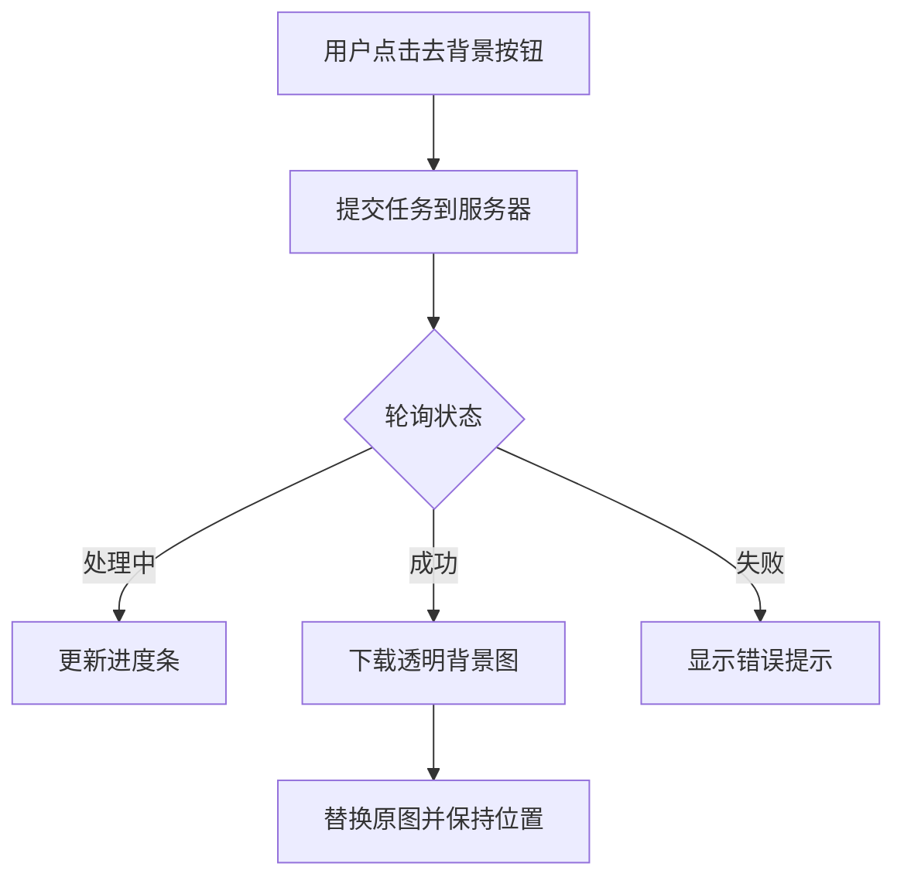

### **图片去背景（Remove Background）功能实现详解**

---

#### **一、整体流程概述**
这段代码实现了基于AI的图片背景去除功能，核心流程如下：
1. **提交去背景任务**：将原图发送到后端处理
2. **轮询任务状态**：持续检查处理进度
3. **下载并替换图片**：成功后用透明背景图替换原图
4. **错误处理**：失败时回滚状态并提示



---

#### **二、核心代码分步解析**

##### **1. 触发去背景操作**
```typescript
// Image类中的属性设置器
set _rbLoading(value) {
  if (this.upscalerLoading) return // 互斥检查
  this.rbLoading = value
  if (value) {
    toast.show('Removing Background...') // 显示加载提示
    createRBImage.bind(this)() // 启动去背景流程
  }
}
```
**关键逻辑**：
- 互斥锁定：防止同时进行放大和去背景操作
- 状态绑定：通过属性设置器触发操作

##### **2. 提交处理任务**
```typescript
async function createRBImage() {
  const response = await createRemoveBGImage({
    src_image: this.key_prefix, // 图片唯一标识
    project_id: this._projectId // 关联项目ID
  })
  
  if (response.data.task_id) {
    getRBImage(response.data.task_id, 0) // 开始轮询
  } else {
    handleError() // 错误处理
  }
}
```
**接口参数示例**：
```json
{
  "src_image": "image_123.png",
  "project_id": "project_456"
}
```

##### **3. 轮询任务状态**
```typescript
async function getRBImage(task_id, rbCount) {
  const response = await getRemoveBGImage({ task_id })
  
  switch(response.data.status) {
    case 0: // 排队中
    case 1: // 处理中
      updateProgress() // 更新前端进度
      setTimeout(() => getRBImage(...), 3000) // 3秒后再次查询
      break;
    case 2: // 成功
      handleCompletion(response.data.result_list)
      break;
    default: // 失败
      handleError()
  }
}
```
**进度更新逻辑**：
```typescript
if (this._rbProcess <= 80) {
  this._rbProcess += 20 // 每3秒+20%
} else if (后端返回100%) {
  this._rbProcess = 100 // 直接跳转完成
}
```

##### **4. 图片替换逻辑**
```typescript
async function handleRBImageCompletion(result_list) {
  const { download_url } = result_list[0]
  const resultBase64 = await getBase64Image(download_url) // 下载图片
  
  const resultImage = await Image.fromURL(resultBase64, {
    key_prefix: 'bg_removed',
    fileType: 'png' // 透明背景必须用PNG
  })
  
  // 保持显示尺寸一致
  resultImage.set({
    left: this.left,
    top: this.top,
    scaleX: this.scaleX,
    scaleY: this.scaleY,
    cropX: this.cropX,
    cropY: this.cropY
  })
  
  this.canvas.remove(this) // 移除原图
  this.canvas.add(resultImage) // 添加新图
}
```
**尺寸保持原理**：
```
原图尺寸：800x600 (scaleX=0.5 → 显示400x300)
新图尺寸：1600x1200 (保持scaleX=0.5 → 仍显示800x600)
```

##### **5. 错误处理机制**
```typescript
function handleRBImageError() {
  this.set({ '_rbLoading': false }) // 重置状态
  toast.error('Processing Failed') // 显示错误提示
  // 埋点统计
  StatisticalReportManager.addEvent('remove_bg_fail')
}
```

---

#### **三、关键技术点解析**

##### **1. 透明背景保持**
```typescript
// 强制使用PNG格式
const resultImage = await Image.fromURL(..., {
  fileType: 'png' // PNG支持透明度
})
```
**为什么必须用PNG**：
- JPEG不支持透明通道
- WebP兼容性可能有问题

##### **2. 画布更新策略**
```typescript
eventBus.emit(EventNameCons.ChangeEditorSaveState, false) // 开始修改
// ...执行图片替换操作
eventBus.emit(EventNameCons.ChangeEditorSaveState, true) // 完成修改
```
**设计目的**：
- 阻止操作过程中的自动保存
- 确保替换操作的原子性

##### **3. 性能优化**
```typescript
// 使用Base64直接加载
const resultBase64 = await getBase64Image(download_url)
```
**优势**：
- 避免二次网络请求
- 兼容本地文件协议

##### **4. 埋点统计实现**
```typescript
StatisticalReportManager.addEvent(
  CONS_STATISTIC_TYPE.canvas_removeBg_click,
  success ? '1' : '0' // 1成功 0失败
)
```
**监控指标**：
- 功能使用次数
- 成功/失败率
- 平均处理时间（需后端配合）

---

#### **四、完整工作流程示例**
1. **用户点击去背景按钮**
   - 原图信息：`key_prefix="photo_123"`, 尺寸1200x800
   
2. **提交任务到后端**
   ```javascript
   POST /api/remove-bg
   {
     "src_image": "photo_123",
     "project_id": "project_456"
   }
   ```
   
3. **后端返回任务ID**
   ```json
   { "task_id": "bg_task_789" }
   ```

4. **前端开始轮询**
   ```javascript
   第1次请求：状态0（排队中）→ 进度20%
   第2次请求：状态1（处理中）→ 进度40%
   第3次请求：状态2（完成）→ 进度100%
   ```

5. **下载并替换图片**
   - 新图尺寸：1200x800（透明背景PNG）
   - 保持位置：`left: 100, top: 50`
   - 保持缩放：`scaleX: 0.8, scaleY: 0.8`

---

#### **五、与放大功能的对比**

| 功能点         | 去背景                  | 图片放大                |
|----------------|-------------------------|-------------------------|
| 核心算法       | 语义分割                | 超分辨率重建            |
| 输出格式       | PNG（透明）             | 任意格式                |
| 尺寸变化       | 保持原尺寸              | 可能增大尺寸            |
| 进度模拟策略   | 每3秒+20%               | 同左                    |
| 关键属性       | rbLoading/rbProcess     | upscalerLoading/Process|

---

#### **六、常见问题处理**

1. **白边问题**
   ```typescript
   // 可添加边缘检测逻辑
   resultImage.set({
     stroke: '#fff', // 添加白色描边
     strokeWidth: 2  // 覆盖残留背景
   })
   ```

2. **复杂背景处理**
   ```typescript
   // 建议后端的AI模型应具备：
   - 头发丝级分割能力
   - 半透明物体处理
   - 阴影保留功能
   ```

3. **大图性能优化**
   ```typescript
   // 采用分块加载策略
   const img = new Image()
   img.src = URL.createObjectURL(blob)
   img.decode().then(() => canvas.add(img)) // 异步解码
   ```

---

#### **七、代码优化建议**

1. **真实进度反馈**
   ```typescript
   // 修改进度更新逻辑
   this._rbProcess = response.data.progress // 使用真实进度值
   ```

2. **取消操作支持**
   ```typescript
   let abortController = new AbortController()
   fetch(url, { signal: abortController.signal })
   // 用户取消时调用
   abortController.abort()
   ```

3. **本地预览优化**
   ```typescript
   // 在前端先进行低精度处理
   const previewCanvas = document.createElement('canvas')
   previewCanvas.drawImage(originalImg)
   applyLowQualityBGRemoval(previewCanvas) // 本地快速预览
   ```

---

通过这个详细解析，你应该能够完全理解去背景功能的实现机制。从任务提交、状态轮询到最终的图片替换，每个环节都紧密结合，共同完成了精准高效的背景去除体验。
