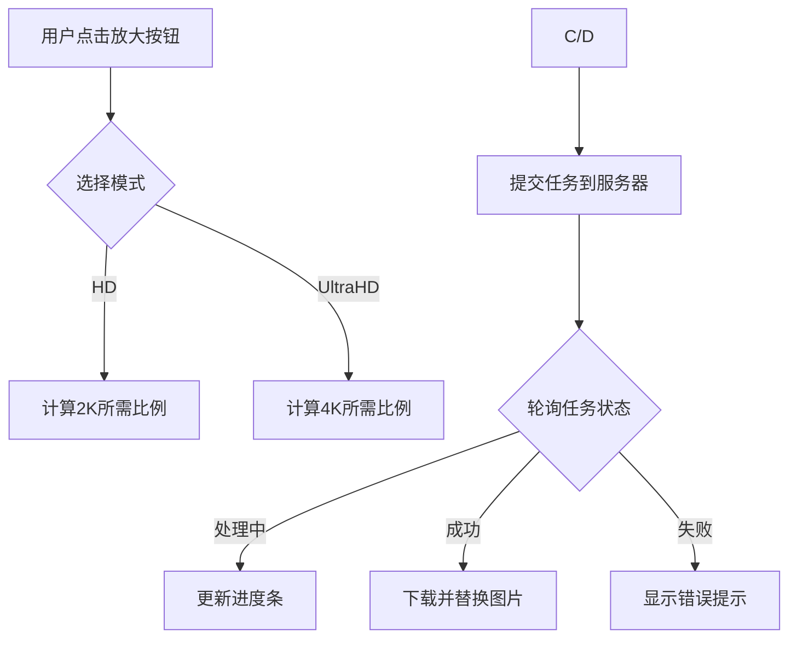

---

### **一、基础概念理解**
#### **1. 什么是图片放大（Upscale）？**
- 传统放大：简单拉伸像素，导致模糊和马赛克
- 超分辨率放大：利用AI算法补充细节，提升清晰度（本文实现的方式）

#### **2. 关键技术指标**
- **2K（HD）**：分辨率2560x1440（约370万像素）
- **4K（UltraHD）**：分辨率3860x2160（约830万像素）
- **放大倍数**：2K模式最大4倍，4K模式最大8倍

#### **3. 流程概览**


---

### **二、核心代码详解**
#### **1. 工具函数准备**
```typescript
// 获取图片原始尺寸
export const getImageSize = (src: string): Promise<ImageSize> => {
  // 创建隐藏的标签加载图片
  const img = document.createElement('img')
  img.style.opacity = '0' // 隐藏图片
  // 通过onload获取真实尺寸
  img.onload = () => resolve({ width: img.clientWidth, height: img.clientHeight })
}

// 计算缩放比例的核心算法
export function getScaleSize(originalWidth, originalHeight, targetArea) {
  const ratio = originalWidth / originalHeight // 原始宽高比
  const newWidth = Math.sqrt(targetArea * ratio) // 根据面积和比例计算新宽度
  const newHeight = newWidth / ratio // 保持比例计算高度
  return { width: newWidth, height: newHeight }
}
```
**示例计算**：原图800x600，目标2K（3686400像素）
```
ratio = 800/600 ≈ 1.333
newWidth = √(3686400*1.333) ≈ 2560
newHeight = 2560/1.333 ≈ 1920
实际尺寸：2560x1920（4倍放大）
```

#### **2. 图片类扩展（关键属性）**
```typescript
export class Image extends fabric.Image {
  // 放大相关属性
  public upscalerResolution?: number; // 选择的模式（2=HD，4=UltraHD）
  public upscalerLoading?: boolean;   // 加载状态
  public upscalerProcess?: number;    // 进度百分比

  // 双击进入裁剪模式
  doubleClickHandler() {
    this.set({ _isCropping: true }) // 激活裁剪状态
  }
  
  // 自定义渲染逻辑
  _render(ctx: CanvasRenderingContext2D) {
    if (this._isCropping) {
      // 绘制半透明蒙版
      ctx.globalAlpha = 0.2
      ctx.drawImage(...) 
      // 绘制紫色边框
      ctx.strokeStyle = '#7356c9'
      ctx.strokeRect(...)
    }
  }
}
```

#### **3. 放大主流程代码**
##### **(1) 初始化放大任务**
```typescript
async function upscale() {
  // 计算目标缩放比例
  let out_scale: number;
  if (this.upscalerResolution === UpscalerType.HD) { // HD模式
    const translateArea = getScaleSize(this.width, this.height, HD_area)
    out_scale = Math.min(translateArea.width / this.width, 4) // 不超过4倍
  }
  // ...类似处理UltraHD模式

  // 提交任务到后端
  const response = await createUpscalerImage({
    src_image: this.key_prefix, // 图片唯一标识
    out_scale,                  // 计算出的缩放比例
    project_id: this._projectId // 关联项目ID
  })

  if (response.data.task_id) {
    upscaling.bind(this)(response.data.task_id) // 开始轮询
  } else {
    toast.error('处理失败') // 错误提示
  }
}
```

##### **(2) 轮询任务状态**
```typescript
async function upscaling(task_id: string) {
  const response = await getUpscalerImage({ task_id })
  
  // 状态处理
  switch(response.data.status) {
    case 0: // 排队中
    case 1: // 处理中
      // 前端模拟进度：每3秒+20%，直到80%
      if (this._upscalerProcess <= 80) {
        this._upscalerProcess += 20 
      }
      setTimeout(() => upscaling(...), 3000) // 3秒后再次查询
      break;
      
    case 2: // 处理完成
      const resultImage = await Image.fromURL(...) // 加载新图
      // 计算缩放比例保持显示尺寸一致
      const scaleX = (this.width * this.scaleX) / resultImage.width
      const scaleY = (this.height * this.scaleY) / resultImage.height
      // 替换原图
      this.canvas.remove(this)
      this.canvas.add(resultImage)
      break;
      
    case 3: // 处理失败
    case 4: // 用户取消
      toast.error('处理失败')
      break;
  }
}
```

##### **(3) 图片替换逻辑**
```typescript
// 假设原图显示尺寸为800x600（实际尺寸1600x1200，scale=0.5）
// 新图实际尺寸为3200x2400（放大2倍）
const originDisplayWidth = 1600 * 0.5 = 800
const originDisplayHeight = 1200 * 0.5 = 600

// 新图需要保持800x600显示：
resultImage.scaleX = 800 / 3200 = 0.25
resultImage.scaleY = 600 / 2400 = 0.25
```

#### **4. 错误处理机制**
```typescript
// 统一错误处理
function handleError() {
  this.set({ _upscalerLoading: false }) // 重置加载状态
  toast.error('处理失败，不会扣除积分')
  // 埋点统计
  StatisticalReportManager.addEvent(
    this.upscalerResolution === HD ? 'hd_fail' : 'uhd_fail'
  )
}

// 网络错误处理
const getBase64Image = (url) => {
  return fetch(url)
    .then(response => response.blob())
    .catch(error => {
      ConsoleUtil.log('下载失败:', error)
      throw error // 触发外层catch
    })
}
```

---

### **三、核心难点解析**
#### **1. 动态缩放计算**
```typescript
// 保证不超过最大倍数的同时适配目标分辨率
function calculateScale() {
  const targetArea = mode === HD ? 2560*1440 : 3860*2160
  const { width: targetWidth } = getScaleSize(origW, origH, targetArea)
  
  // 计算实际放大倍数
  let scale = targetWidth / origW
  // 应用最大限制
  scale = Math.min(scale, mode === HD ? 4 : 8)
  return scale
}
```

#### **2. 进度模拟策略**
```typescript
// 前端渐进式进度模拟
if (status === 处理中) {
  if (当前进度 <= 80) {
    进度 += 20% // 每3秒增加20%
  } else if (后端返回100%) {
    直接设为100%
  }
}
```
**设计考虑**：避免长时间无反馈，但又不完全依赖后端进度

#### **3. 图片替换的尺寸同步**
```typescript
// 保持显示尺寸不变的公式
新图scaleX = (原图width * 原图scaleX) / 新图width
新图scaleY = (原图height * 原图scaleY) / 新图height
```
**示例**：
```
原图：实际1600x1200，scale=0.5 → 显示800x600
新图：实际3200x2400（放大2倍）
scaleX = (1600*0.5)/3200 = 0.25
显示尺寸：3200*0.25 = 800
```

---

### **四、完整工作流程示例**
1. **用户选择4K模式**
   - 原图尺寸：800x600
   - 目标面积：3860x2160 = 8,337,600
   - 计算最大尺寸：√(8,337,600*(800/600)) ≈ 3860x2895
   - 实际放大倍数：3860/800 ≈ 4.825倍（小于8倍限制）

2. **提交任务**
   ```json
   {
     "src_image": "image_123",
     "out_scale": 4.825,
     "project_id": "project_456"
   }
   ```

3. **轮询过程**
   - 第1次：进度20% → 显示"Upscaling... (20%)"
   - 第4次：进度80% → 保持80%直到后端完成
   - 后端返回100%时直接显示完成

4. **结果替换**
   - 新图尺寸：3860x2895
   - 计算scale值：800/3860≈0.2073
   - 应用相同位置和裁剪参数

---

### **五、常见问题处理**
1. **图片变形问题**
   - 始终通过`getScaleSize`保持原始宽高比
   - 在替换时自动计算适配比例

2. **大图加载卡顿**
   - 使用`createImageBitmap`优化大图解码
   - 分块加载策略（当前代码未实现）

3. **网络中断恢复**
   - 当前实现：直接报错
   - 优化建议：添加重试机制

---

### **六、代码优化建议**
1. **进度真实性优化**
   ```typescript
   // 改为真实进度（需后端支持）
   this._upscalerProcess = response.data.progress
   ```

2. **错误类型细分**
   ```typescript
   enum ErrorType {
     Network = 1,
     Server = 2,
     Timeout = 3
   }
   ```

3. **取消操作支持**
   ```typescript
   let abortController = new AbortController()
   fetch(url, { signal: abortController.signal })
   // 用户取消时调用
   abortController.abort()
   ```

---
