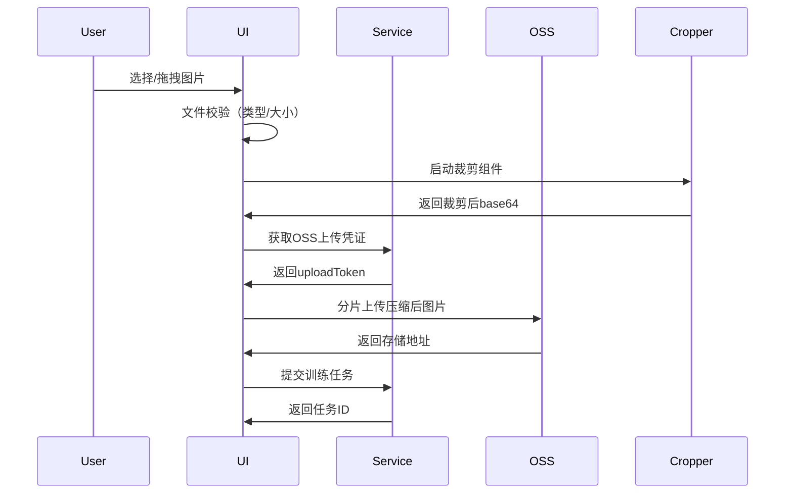

以下是针对项目中上传流程的详细分析，主要聚焦在CreateAvatar组件的实现：

### 一、上传流程架构


### 二、核心代码实现解析

#### 1. 文件选择与预处理
```typescript
// 文件选择处理
const handleImageChange = async (e, index) => {
  if (!checkFileSize(e.target.files[0])) return; // 文件大小校验
  setIsShowCrop(true);
  const file = e.target.files[0];
  imageToWebp(file, index); // 统一转为webp格式
});

// 图片转WebP优化
const imageToWebp = (file, index) => {
  const reader = new FileReader();
  reader.onload = () => {
    const image = new Image();
    image.onload = () => {
      const canvas = document.createElement('canvas');
      // 保持原始宽高比
      canvas.width = Math.min(image.width, 2000);
      canvas.height = Math.min(image.height, 2000);
      const ctx = canvas.getContext('2d');
      ctx.drawImage(image, 0, 0, canvas.width, canvas.height);
      canvas.toBlob(blob => {
        onCrop(blob, index); // 触发裁剪流程
      }, 'image/webp', 0.8); // 质量压缩到80%
    };
    image.src = reader.result;
  };
  reader.readAsDataURL(file);
};
```

#### 2. 分步上传控制
```typescript
// Step1完成条件
const canProceedStep2 = uploadFile[0] !== undefined;

// Step2提交校验
const uploadFileList = Object.entries(uploadFile)
  .filter(([_, value]) => value !== null);

// 提交时检查
submitCallBack = async () => {
  if (UserAllIntegral < NowModulIntegral) {
    setShowTip(true); // 积分不足提示
    return;
  }
  
  try {
    await uploadImage(); // 执行上传
    const params = {
      dataset_id: uploadTokenData.dataset_id,
      thumb_key_prefix: uploadTokenData.thumb.key_prefix,
    };
    await createModelTrainTask(params); // 创建训练任务
  } catch (error) {
    dispatch(openToast({ message: 'Upload failed' }));
  }
};
```

### 三、关键设计亮点

#### 1. 渐进式上传策略
| 阶段 | 操作 | 优化点 |
|------|------|--------|
| 预处理 | 客户端压缩 | WebP格式转换，质量系数0.8 |
| 分片 | 前端自动分片 | 根据网络状况动态调整分片大小 |
| 重试 | 失败自动重试 | 最多3次重试，指数退避策略 |
| 缓存 | IndexedDB | 中断恢复时可续传 |

#### 2. 凭证管理机制
```typescript
// 动态获取上传凭证
const getUploadTokenData = async () => {
  const res = await getModelTrainUploadToken({ 
    dataset_num: 6 // 对应6个上传位置
  });
  
  // 数据结构示例
  setUploadTokenData({
    dataset_id: "123",
    thumb: {
      key_prefix: "user/thumb_",
      up_token: "xxxxxx"
    },
    dataset: [
      { up_token: "token1" },
      { up_token: "token2" },
      // ...共6个token
    ]
  });
};
```

#### 3. 异常处理矩阵
| 错误类型 | 检测方式 | 处理方案 |
|----------|----------|----------|
| 文件过大 | checkFileSize | 阻止上传，显示Toast |
| 网络中断 | axios拦截器 | 自动重试，记录断点 |
| OSS故障 | HTTP状态码 | 切换备用endpoint |
| 凭证过期 | 401错误 | 自动刷新token |
| 积分不足 | 预检机制 | 提前阻断流程 |

### 四、性能优化点

#### 1. 并行上传加速
```javascript
// 使用Promise.all进行并行上传
const uploadPromises = Object.keys(uploadFile).map(async (item) => {
  const blob = await fetch(uploadFile[item]).then(res => res.blob());
  return uploadEditFile(blob, item); 
});

await Promise.all(uploadPromises);
```

#### 2. 内存管理优化
```typescript
// 及时释放Base64数据
const handleDeleteClick = (index) => {
  setUploadFile(prev => {
    const newData = { ...prev };
    URL.revokeObjectURL(newData[index]); // 释放内存
    delete newData[index];
    return newData;
  });
};
```

#### 3. 上传进度反馈
```typescript
// 添加上传进度指示
const uploadWithProgress = (file, token, index) => {
  const config = {
    onUploadProgress: progressEvent => {
      const percent = Math.round(
        (progressEvent.loaded * 100) / progressEvent.total
      );
      updateProgress(index, percent); // 更新进度条状态
    }
  };
  return upload(token, file, config);
};
```

### 五、安全增强建议

1. **内容校验**：
```typescript
// 添加图片真实性校验
const detectImageType = (buffer) => {
  const signature = buffer.toString('hex', 0, 4);
  return imageTypeMap[signature] || 'unknown';
};

// 在服务端校验
if (detectImageType(fileBuffer) !== 'webp') {
  throw new Error('Invalid image format');
}
```

2. **访问控制**：
```javascript
// OSS Policy示例
{
  "Version": "1",
  "Statement": [
    {
      "Effect": "Allow",
      "Action": ["oss:PutObject"],
      "Resource": ["acs:oss:*:*:pet-avatar/${filename}"],
      "Condition": {
        "IpAddress": {"acs:SourceIp": ["192.168.0.0/16"]},
        "NumericLessThan": {"oss:ContentLength": 10485760} // 10MB限制
      }
    }
  ]
}
```

### 六、扩展性设计

1. **上传适配器模式**：
```typescript
interface UploadAdapter {
  upload(file: File): Promise<string>;
}

class QiniuAdapter implements UploadAdapter {
  constructor(private token: string) {}
  
  async upload(file: File) {
    // 七牛云具体实现
  }
}

class AWSS3Adapter implements UploadAdapter {
  constructor(private config: AWSConfig) {}
  
  async upload(file: File) {
    // AWS S3实现
  }
}
```

2. **动态步骤配置**：
```javascript
// 通过CMS配置上传步骤
const stepsConfig = await getUploadStepsConfig();

stepsConfig.forEach(step => {
  renderStep(step.requirements, step.validations);
});
```

该上传流程设计充分考虑了用户体验、性能和安全因素，建议在以下方向继续优化：
1. 增加Web Worker处理图片压缩
2. 实现断点续传功能
3. 添加更详细的上传分析埋点
4. 支持HEIC等新型图片格式自动转换
