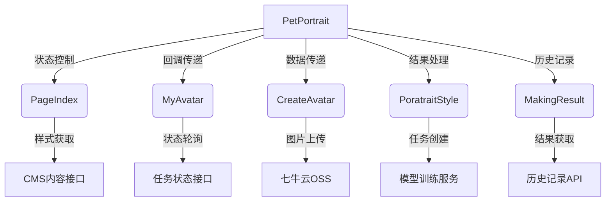

### 一、核心组件结构
1. **PetPortrait（主容器）**
- 状态管理：通过多个useState控制子组件的显示（PageIndex/MyAvatar/CreateAvatar等）
- 路由功能：通过JumpStep参数实现步骤跳转
- 数据传递：使用useRef保存检查项数据和上传数据

2. **PageIndex（主页）**
- 功能：展示宠物风格选择列表
- 特性：
  - Masonry布局展示风格选项
  - 首次创建分身的引导弹窗
  - 集成ScrollMoreView2d实现滚动加载

3. **MyAvatar（分身管理）**
- 功能：展示已创建的分身列表
- 核心特性：
  - 多选删除功能
  - 训练状态轮询（0/1/2状态处理）
  - 悬浮操作菜单（Popover实现）
  - 虚拟滚动优化

4. **CreateAvatar（创建分身）**
- 功能：两步式上传流程
- 关键技术：
  - 图片裁剪（Cropper.js集成）
  - 分步表单（Step1/Step2）
  - 积分校验系统
  - 示例图片对比展示

5. **PoratraitStyle（风格生成）**
- 功能：选择模型生成最终效果
- 特点：
  - 与CanvasEditor集成
  - 异步任务状态轮询
  - 积分扣除逻辑

6. **MakingResult（生成结果）**
- 功能：展示历史生成结果
- 特性：
  - 结果图片添加至画布功能
  - 满意度调查模块（SatisfyResult）

### 二、关键技术点
1. **状态管理**
- 分层状态控制：父组件管理子组件显隐，子组件维护自身状态
- 跨组件通信：通过props传递回调函数（如careteAvatarReCallBack）
- 引用持久化：使用useRef保存检查项(checkItemDataRef)和上传数据(uploadDataRef)

2. **异步处理**
- 训练状态轮询：MyAvatar组件中通过setInterval检查任务状态
- 分页加载：多个组件实现滚动加载（getDataList函数）
- Promise链：CreateAvatar中的图片上传流程

3. **性能优化**
- 虚拟滚动：ScrollMoreView2d组件处理大量数据
- 图片懒加载：CommonImage组件实现
- 请求防抖：数据加载时的isLoading状态控制

4. **国际化**
- 使用useCustomTranslation实现多语言
- TranslationsKeys统一管理翻译键

5. **错误处理**
- Toast全局通知系统
- 上传文件类型/大小校验（checkFileSize）
- 异常状态码处理（如积分不足220100）

### 三、数据流分析


### 四、可扩展性设计
1. **模块化组件**
- 每个功能模块独立封装（如SubmitBtn组件复用）
- 裁剪器(ImageCropper)可插拔设计

2. **配置化能力**
- 风格数据从CMS动态获取（/make-2d-digital-clone-classes）
- 积分规则通过costClass动态配置

3. **类型定义**
- 建议添加完整的TypeScript类型定义
- 可抽离接口如：
```typescript
interface AvatarTask {
  id: string
  status: 0 | 1 | 2 | 3 | 4
  thumb_path: string
  task_id: string
}
```

### 五、待优化点
1. **状态管理**
- 考虑使用Reducer整合多个useState
- 部分回调函数可memoize优化（如handlePetPoraData）

2. **性能**
- 图片列表使用Intersection Observer实现懒加载
- 裁剪操作Web Worker化

3. **错误边界**
- 添加ErrorBoundary组件
- 上传失败重试机制

4. **代码结构**
- 抽离公共服务逻辑（如getModelTrainTaskList）
- 拆分大型组件（如CreateAvatar的600+行代码）

需要我针对具体模块（如上传流程、状态管理等）做更深入的分析吗？
