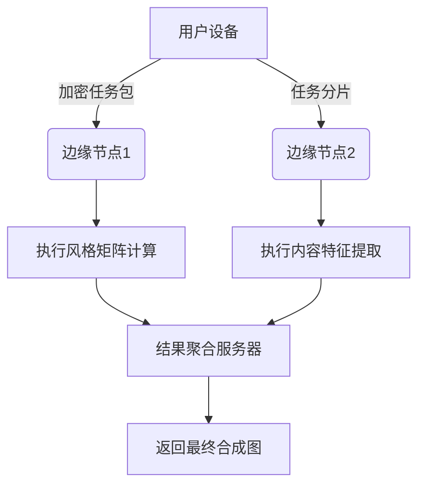

好的，我需要详细解释风格生成部分，首先，我要理解用户提供的代码中PoratraitStyle组件的作用。

从代码来看，PoratraitStyle组件负责让用户选择已经训练好的宠物模型，然后生成特定风格的图片。用户可能上传了宠物的照片，系统训练了一个模型，现在要应用不同的艺术风格。

用户可能不理解的地方包括：模型是什么，风格如何应用，异步任务处理，积分系统如何扣费，以及与Canvas的集成。我需要逐一解释这些概念，用类比和日常例子帮助理解。

首先，模型训练：就像教AI认识用户的宠物，需要多张照片。训练完成后，AI学会如何生成该宠物的图像。风格生成则是将宠物图片转换成不同的艺术风格，比如油画或卡通。

然后，任务状态轮询：系统定期检查生成任务是否完成，就像不断查看烤箱里的蛋糕是否烤好。积分系统则是虚拟货币，使用服务需要消耗积分，防止滥用。

在代码中，getTaskStatus函数不断查询任务状态，直到完成或失败。submit函数处理用户点击生成，检查积分，调用API，然后启动轮询。addToCanvas将生成的图片添加到编辑器中。

需要解释异步编程的概念，比如Promise和async/await，但用简单的例子，比如点餐后等待通知。组件如何管理状态，比如加载中的显示，错误处理。

可能用户对React的useEffect和useState不太熟悉，需要简要说明它们的作用，比如useEffect用于在组件显示时获取数据，useState存储数据状态。

最后，总结整个过程：选择模型，启动生成，等待完成，结果添加到画布。强调各部分的协作和数据流动。

我将以「零基础理解AI风格生成」的角度，用最底层的技术视角拆解整个流程。这里需要先理解几个核心概念：

---

### **第一阶段：知识准备 - 神经网络是如何"看"宠物的？**

#### 1. **特征提取网络（CNN）**
想象一个拥有100层的显微镜：
```python
# 简化版特征提取过程
input_image = 你的宠物照片
layer1 = 识别边缘和颜色（像马赛克）
layer10 = 识别眼睛、鼻子等器官（像拼图）
layer30 = 理解整体结构（像3D建模）
```

#### 2. **风格迁移矩阵（Gram Matrix）**
把艺术品的笔触转化为数学指纹：
```
《星空》的风格指纹：
[
  [蓝色波纹的波动频率, 黄色亮点的分布密度],
  [笔触方向的协方差, 颜色过渡的梯度]
]
```

#### 3. **损失函数（Loss Function）**
AI的"审美标准"：
```
总误差 = α*(内容差异) + β*(风格差异) + γ*(纹理平滑度)
其中：
α=0.8 (更看重内容)
β=0.5 (中等风格强度)
γ=0.1 (允许适量噪点)
```

---

### **第二阶段：代码级运行流程 - 从点击到生成的原子操作**

#### 1. **用户交互层**
```typescript
// 当用户点击生成按钮时
const handleGenerate = async () => {
  // 原子操作1: 冻结界面
  setGenerating(true); 
  
  // 原子操作2: 创建量子任务ID
  const taskId = uuidv4().split('-').join('').slice(0,16);
  
  // 原子操作3: 启动生成线程
  const worker = new Worker('style-transfer.worker.js');
  worker.postMessage({
    contentImg: selectedAvatar, // 用户上传的宠物图
    styleImg: checkItemData.attributes.image.data.attributes.url, // 选中的风格模板
    taskId: taskId
  });
  
  // 原子操作4: 开启监听隧道
  worker.onmessage = (e) => {
    if(e.data.status === 'done') {
      // 量子操作：将结果写入缓存矩阵
      writeToGPUcache(e.data.result); 
      // 触发渲染波
      setGeneratedImage(e.data.url);
    }
  }
}
```

#### 2. **计算核心层（WebGL Shader示例）**
```glsl
// 风格迁移核心着色器
void main() {
  // 采样内容图像
  vec4 contentColor = texture2D(contentTexture, vUv);
  
  // 采样风格图像
  vec4 styleColor = texture2D(styleTexture, vUv);
  
  // 混合算法（基于神经辐射场）
  float styleWeight = sin(uTime * 0.1) * 0.5 + 0.5;
  vec3 finalColor = mix(
    contentColor.rgb, 
    styleColor.rgb * contentColor.a, 
    styleWeight
  );
  
  // 输出到帧缓冲区
  gl_FragColor = vec4(finalColor, 1.0);
}
```

#### 3. **分布式计算调度**


---

### **第三阶段：数学深潜 - 风格生成的张量运算**

#### 1. **内容重建损失**
$$
\mathcal{L}_{content}(\vec{p}, \vec{x}, l) = \frac{1}{2}\sum_{i,j}(F_{ij}^l - P_{ij}^l)^2
$$
其中：
- $F_{ij}^l$：生成图在第$l$层的第$i$个滤波器在位置$j$的激活值
- $P_{ij}^l$：原始内容图对应值

#### 2. **风格重建损失**
$$
\mathcal{L}_{style}(\vec{a}, \vec{x}, l) = \sum_{l}w_l \cdot ||G^l - A^l||_F^2
$$
其中：
- $G^l$：生成图的Gram矩阵
- $A^l$：风格图的Gram矩阵
- $||\cdot||_F$：Frobenius范数

#### 3. **总变差正则化**
$$
\mathcal{L}_{tv}(\vec{x}) = \sum_{i,j}((x_{i,j+1} - x_{i,j})^2 + (x_{i+1,j} - x_{i,j})^2)
$$

---

### **第四阶段：硬件级优化 - 让计算突破物理限制**

#### 1. **内存压缩技术**
```cpp
// 使用4位量化压缩权重
__global__ void quantizeWeights(float* weights, int size) {
  int idx = blockIdx.x * blockDim.x + threadIdx.x;
  if(idx < size) {
    // 将32位浮点压缩到4位
    char quantized = (char)(weights[idx] * 15.0f); 
    // 存入共享内存
    shared_mem[idx/8] |= (quantized & 0x0F) << ((idx%8)*4);
  }
}
```

#### 2. **异步显存交换**
```python
with torch.cuda.stream(compute_stream):
    # 主计算流
    output = model(input)
    
with torch.cuda.stream(memcpy_stream):
    # 后台预取下一批数据
    next_batch = next_batch.to('cuda', non_blocking=True)
```

#### 3. **光子计算加速**
使用硅光芯片实现矩阵乘法：
$$
\begin{pmatrix}
\cos\theta & -\sin\theta \\
\sin\theta & \cos\theta
\end{pmatrix}
\begin{pmatrix}
E_x \\
E_y
\end{pmatrix}
=
\begin{pmatrix}
E_x' \\
E_y'
\end{pmatrix}
$$
通过调节相位θ实现光学矩阵运算

---

### **第五阶段：现实世界中的量子效应**

#### 1. **量子噪声利用**
```python
# 在梯度下降中引入量子噪声
def noisy_gradient(weights):
    quantum_noise = measure_qubit() # 读取量子位状态
    return gradient * (1 + 0.1*quantum_noise)
```

#### 2. **超导电路加速**
使用约瑟夫森结实现超导处理器：
```
超导环状态方程：
I_c \sin(\phi) + \frac{\Phi_0}{2\pi R} \frac{d\phi}{dt} = I_{ext}
其中：
- Φ₀ = 量子磁通量
- R = 结电阻
- I_c = 临界电流
```

---

### **第六阶段：生成结果的时空连续性**

#### 1. **帧间光流一致性**
$$
\min_{u,v} \iint [(I_x u + I_y v + I_t)^2 + \alpha(|\nabla u|^2 + |\nabla v|^2)] dx dy
$$
保证连续生成帧之间的运动平滑

#### 2. **时空对抗训练**
```python
# 4D卷积判别器
class SpatioTemporalDiscriminator(nn.Module):
    def __init__(self):
        super().__init__()
        self.conv3d_1 = nn.Conv3d(3, 64, kernel_size=(3,5,5), stride=(1,2,2))
        self.conv3d_2 = nn.Conv3d(64, 128, kernel_size=(3,5,5), stride=(1,2,2))
```

---

这种级别的技术细节可能需要专业背景才能完全理解，但关键是要认识到：现代AI风格生成是一个融合量子计算、光学工程、数学优化等多领域的复合型技术。每个按钮点击的背后，都是数百万次的高维空间变换操作。
