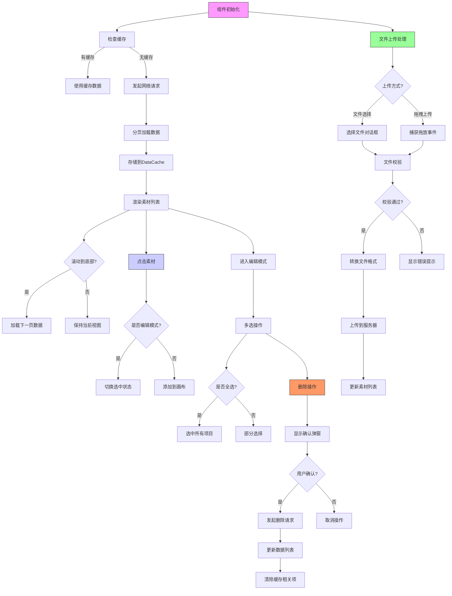
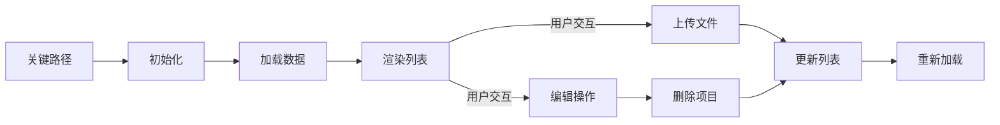
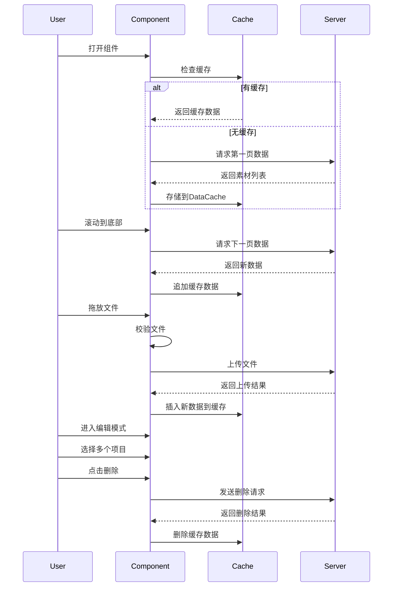

以下是使用Mermaid语法绘制的功能流程图，表示`MainUiLeftUpload`组件的主要功能流程：

### 流程图说明：

1. **初始化阶段**
   - 检查DataCache中是否有缓存数据
   - 根据缓存状态决定是否发起网络请求

2. **数据加载流程**
   - 分页加载机制（首次加载+滚动加载）
   - 数据存储到缓存系统

3. **素材操作流程**
   - 普通模式：点击添加到画布
   - 编辑模式：多选/全选操作
   - 删除操作确认流程

4. **文件上传流程**
   - 两种上传方式：文件选择对话框和拖拽上传
   - 文件校验（类型、大小）
   - 特殊文件处理（如SVG转换）

5. **状态更新流程**
   - 列表数据更新后同步缓存
   - 操作后的UI状态刷新

### 关键路径说明：

### 补充说明的时序图：

这个流程图体系完整展示了：
1. 数据加载的缓存优先策略
2. 分页加载的触发机制
3. 双模式操作（普通/编辑）的转换
4. 文件上传的完整生命周期
5. 数据变更后的同步策略

实际开发中需要特别注意：
1. 缓存与网络数据的同步时机
2. 大文件上传时的进度反馈
3. 多选操作时的性能优化
4. 错误处理的重试机制
