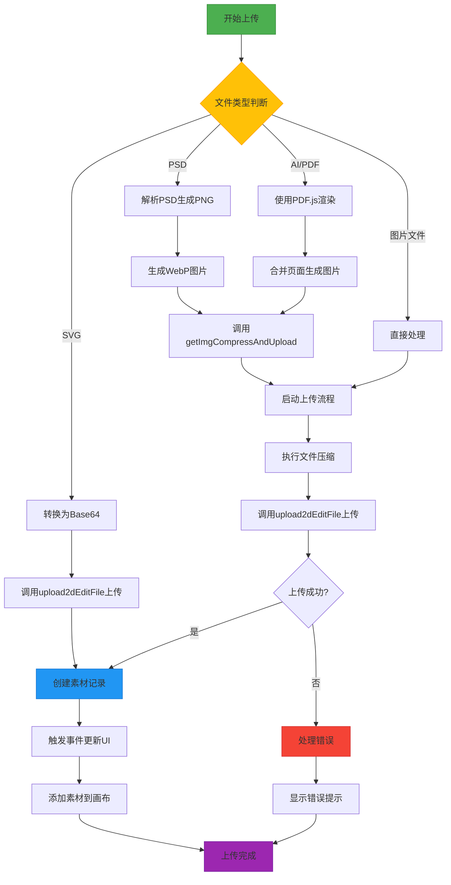
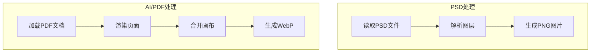
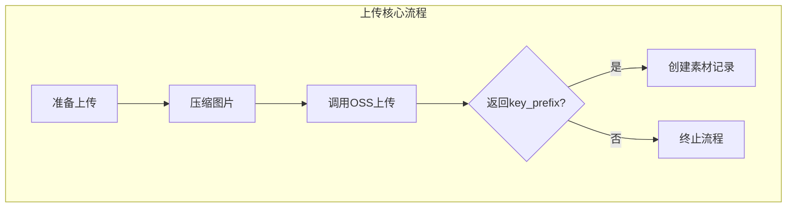
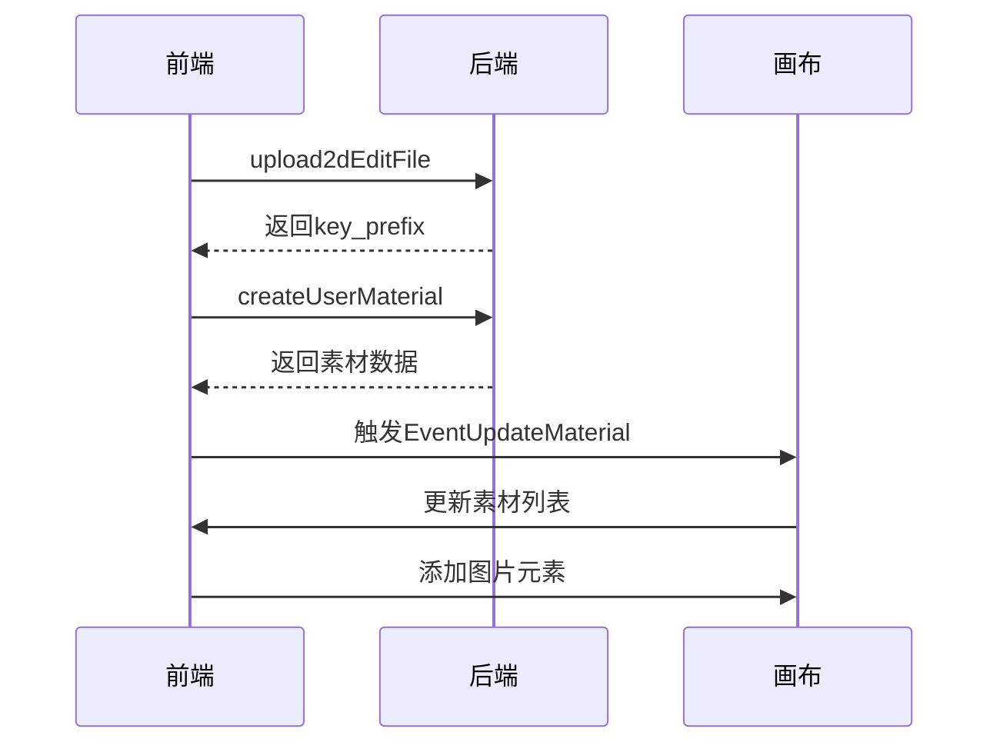

以下是用Mermaid语法绘制的文件上传模块流程图：

### 详细流程说明：

1. **文件类型判断分支**：
- SVG：直接转换Base64后上传
- PSD：解析后转换为PNG格式
- AI/PDF：使用PDF.js渲染后合并页面
- 普通图片：JPEG/JPG/PNG/WebP直接处理

2. **特殊文件处理**：

3. **通用上传流程**：

4. **状态更新机制**：

### 关键特性说明：
1. **文件类型适配**：
- 支持7种文件格式：SVG/PSD/AI/PDF/JPG/PNG/WebP
- 特殊格式转换：PSD→PNG，AI/PDF→WebP

2. **优化处理**：
- 图片压缩：在保持质量的前提下减少文件体积
- 分步上传：先传文件到OSS再创建素材记录
- 事件驱动：通过EventEmitter更新UI

3. **错误处理**：
- 文件大小校验（通过checkFileSize）
- 上传失败重试机制
- 错误状态回调（updateEnd）

4. **扩展性设计**：
- 支持项目关联上传（projectId参数）
- 支持不同存储类型（uploadFileType参数）
- 支持画布直接添加（canvasEditor集成）

该流程图展示了从文件选择到最终完成上传的完整生命周期，涵盖了不同文件类型的处理策略、核心上传逻辑和状态管理机制。
