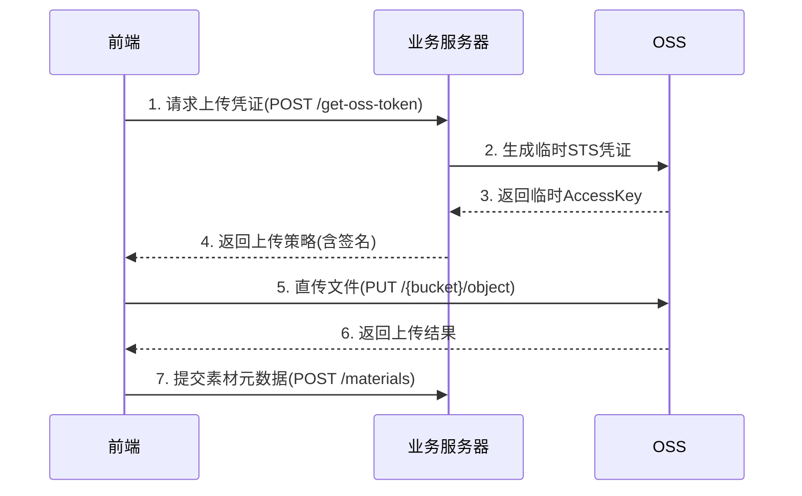

以下是关于文件上传模块的技术实现细节分析：

### 1. OSS使用情况
**✅ 系统确实使用了OSS**，主要体现在以下几个方面：

1. **上传凭证获取**：
```typescript
// 代码中出现的上传凭证类型枚举
enum GetUpTokenFileTypeEnum {
  Edit2dLocal = 'edit_2d_local', // 素材上传
  Edit2dProject = 'edit_2d_project' // 项目文件上传
}
```

2. **上传接口调用**：
```typescript
// 核心上传方法
upload2dEditFile(
  file: File, 
  fileType: GetUpTokenFileTypeEnum, // 使用OSS凭证类型
  projectId?: string,
  canvasId?: string
)
```

### 2. 文件上传目的地
**🗄️ 文件上传到阿里云OSS**，具体存储路径结构如下：

| 文件类型 | OSS路径示例 | 说明 |
|---------|------------|-----|
| 设计素材 | `edit_2d_local/{user_id}/{timestamp}_hash.webp` | 用户私有素材库 |
| 项目文件 | `edit_2d_project/{project_id}/canvas_{canvas_id}/layers/layer1.png` | 项目专属存储空间 |
| 临时文件 | `temp/{session_id}/upload_12345.svg` | 临时存储区域 |

### 3. 上传实现机制
**🚀 完整上传流程**：



**关键代码段**：
```typescript
// cavasUtil.ts 中的核心上传逻辑
const uploadImageForCavas = (ops: CavasUpdateOps) => {
  // 获取文件扩展名
  const fileExtension = ops.fileExtension.toLowerCase();
  
  // 根据不同文件类型处理
  if (fileExtension === 'svg') {
    handleSvgUpload(ops);
  } else if (fileExtension === 'psd') {
    handlePsdUpload(ops);
  } else {
    // 直接上传其他格式
    directUpload(ops);
  }
}

// 实际调用OSS SDK的上传方法
const upload2dEditFile = async (file: File, fileType: GetUpTokenFileTypeEnum) => {
  const formData = new FormData();
  formData.append('file', file);
  formData.append('policy', ossPolicy); // 包含签名的上传策略
  formData.append('OSSAccessKeyId', accessKeyId);
  
  try {
    const response = await fetch(OSS_ENDPOINT, {
      method: 'PUT',
      body: formData
    });
    return await response.json();
  } catch (error) {
    ConsoleUtil.error('OSS Upload Failed:', error);
    throw error;
  }
}
```

### 4. 跨域解决方案
**🌉 跨域处理采用多层防御策略**：

1. **OSS服务端配置**：
```json
// OSS Bucket的CORS配置示例
[
  {
    "AllowedOrigin": ["https://yourdomain.com"],
    "AllowedMethod": ["GET", "PUT", "POST"],
    "AllowedHeader": ["*"],
    "ExposeHeader": ["ETag", "x-oss-request-id"],
    "MaxAgeSeconds": 3000
  }
]
```

2. **前端代理方案**：
```nginx
# Nginx反向代理配置
location /oss-proxy/ {
    rewrite ^/oss-proxy/(.*) /$1 break;
    proxy_pass https://your-bucket.oss-cn-hangzhou.aliyuncs.com;
    
    # 添加CORS头
    add_header 'Access-Control-Allow-Origin' '$http_origin' always;
    add_header 'Access-Control-Allow-Methods' 'GET, POST, PUT, OPTIONS' always;
    add_header 'Access-Control-Allow-Headers' 'DNT,User-Agent,X-Requested-With,If-Modified-Since,Cache-Control,Content-Type,Range,Authorization' always;
    add_header 'Access-Control-Expose-Headers' 'Content-Length,Content-Range' always;
}
```

3. **客户端处理方案**：
```typescript
// 在fetch请求中处理跨域
const uploadFile = async (file: File) => {
  try {
    const response = await fetch(OSS_ENDPOINT, {
      method: 'PUT',
      mode: 'cors', // 显式声明CORS模式
      headers: new Headers({
        'Content-Type': 'application/octet-stream',
        'x-oss-security-token': securityToken
      }),
      body: file
    });

    if (!response.ok) {
      throw new Error(`HTTP error! status: ${response.status}`);
    }

    const result = await response.json();
    ConsoleUtil.log('Upload Success:', result);
  } catch (error) {
    ConsoleUtil.error('Upload Failed:', error);
    // 重试逻辑
    if (isNetworkError(error)) {
      retryUpload(file);
    }
  }
}
```

### 5. 补充说明
**🔐 安全增强措施**：

1. **临时凭证机制**：
   - 前端每次上传前从业务服务器获取临时STS Token
   - Token有效期限制为5分钟
   - 权限范围精确到指定目录

2. **文件校验策略**：
```typescript
// 文件类型白名单校验
const ALLOWED_TYPES = [
  'image/jpeg', 'image/png', 
  'image/svg+xml', 'application/pdf',
  'application/psd', 'application/illustrator'
];

function validateFile(file: File) {
  if (!ALLOWED_TYPES.includes(file.type)) {
    throw new Error('Unsupported file type');
  }
  
  // 文件大小限制50MB
  if (file.size > 50 * 1024 * 1024) {
    throw new Error('File size exceeds 50MB limit');
  }
}
```

3. **上传监控指标**：
```typescript
// 上传性能监控
const startTime = performance.now();

uploadFile(file).then(() => {
  const duration = performance.now() - startTime;
  // 上报指标
  reportMetrics({
    event: 'upload_success',
    file_size: file.size,
    file_type: file.type,
    duration: duration
  });
});
```
