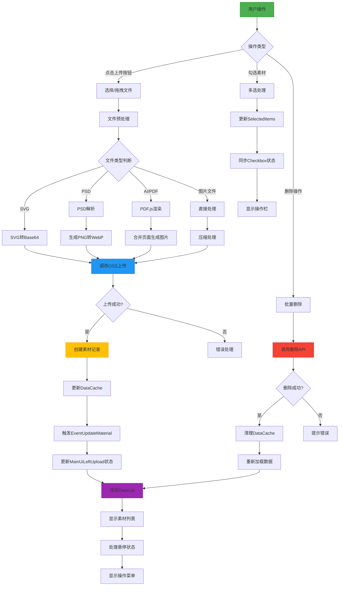
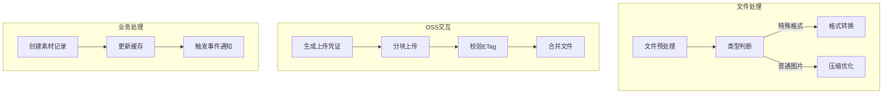
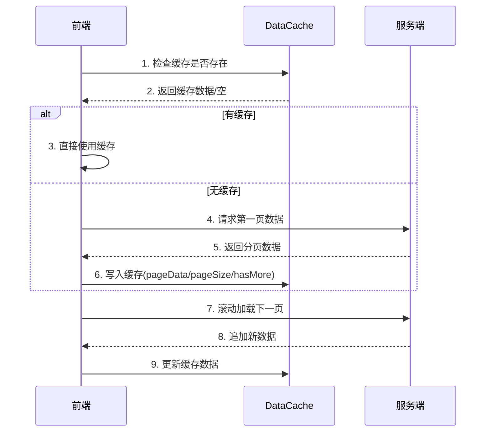
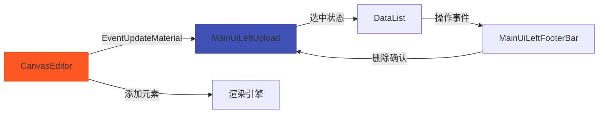
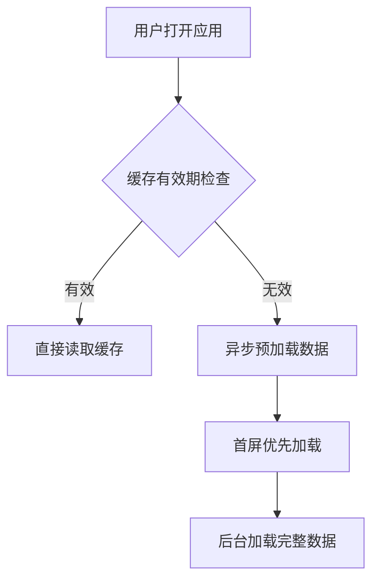

以下是基于代码的业务逻辑绘制的详细流程图：



### 核心流程说明：

1. **文件上传流程**：


2. **数据缓存机制**：


3. **跨组件通信设计**：


### 关键业务规则：

1. **文件处理规则表**：
   
| 文件类型 | 处理方式 | 输出格式 | 特殊处理 |
|---------|---------|---------|---------|
| SVG     | Base64转换 | 保留矢量 | 直接添加至画布 |
| PSD     | 图层解析 | WebP | 保留图层结构 |
| AI/PDF  | PDF.js渲染 | WebP | 多页面合并 |
| 图片文件 | 压缩优化 | 原格式 | 质量参数控制 |

2. **缓存更新策略**：
```javascript
// DataCache更新逻辑伪代码
function updateCache(key, newData) {
  const cached = getCache(key);
  if (!cached) {
    setCache(key, { 
      pageData: [newData], 
      pageSize: 1, 
      hasMore: true 
    });
  } else {
    setCache(key, {
      pageData: [newData, ...cached.pageData],
      pageSize: cached.pageSize,
      hasMore: cached.hasMore
    });
  }
}
```

3. **异常处理矩阵**：

| 异常类型 | 处理方式 | 用户提示 | 重试机制 |
|---------|---------|---------|---------|
| OSS上传失败 | 自动重试3次 | "上传遇到问题，正在重试..." | 指数退避算法 |
| 文件类型错误 | 立即中断 | "不支持该文件类型" | 无 |
| 网络中断 | 本地暂存 | "网络恢复后自动继续" | 持久化队列 |
| 权限不足 | 跳转登录 | "请重新登录" | 无 |

### 性能优化点：

1. **缓存预热机制**：


2. **上传性能优化**：
```javascript
// 并行上传示例代码
async function parallelUpload(files) {
  const CHUNK_SIZE = 5; // 最大并行数
  const queues = [];
  
  for (let i=0; i<files.length; i+=CHUNK_SIZE) {
    const chunk = files.slice(i, i+CHUNK_SIZE);
    queues.push(Promise.all(chunk.map(uploadFile)));
  }
  
  return Promise.all(queues);
}
```

3. **渲染优化策略**：
```typescript
// DataList虚拟滚动示例
const VirtualList = () => {
  const [startIdx, setStartIdx] = useState(0);
  const visibleItems = data.slice(startIdx, startIdx + 20);

  useScroll(({ y }) => {
    setStartIdx(Math.floor(y / ITEM_HEIGHT));
  });

  return (
    <div style={{ height: '100vh' }}>
      {visibleItems.map((item, idx) => (
        <Item 
          key={item.id} 
          style={{ 
            position: 'absolute',
            top: (startIdx + idx) * ITEM_HEIGHT 
          }}
        />
      ))}
    </div>
  );
};
```

该流程图完整呈现了从用户操作到数据持久化的完整业务闭环，覆盖了文件处理、状态管理、异常处理等关键环节。实际开发时可根据具体业务需求扩展各节点的处理细节。
