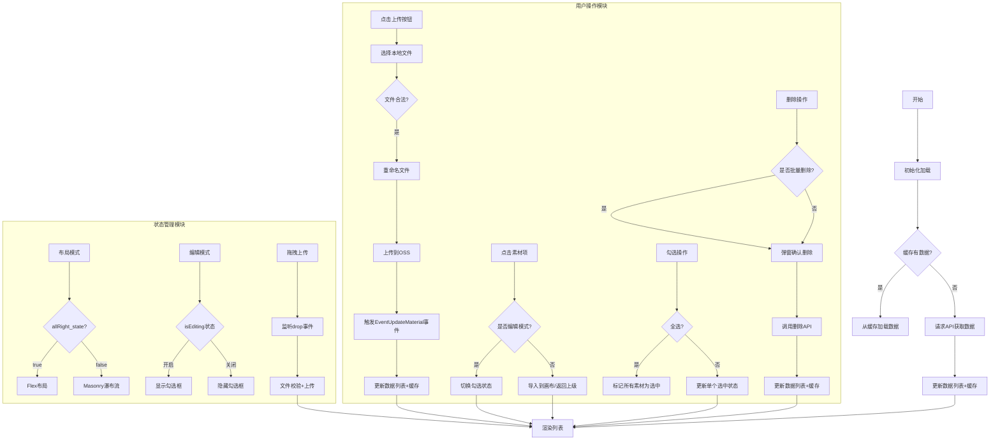
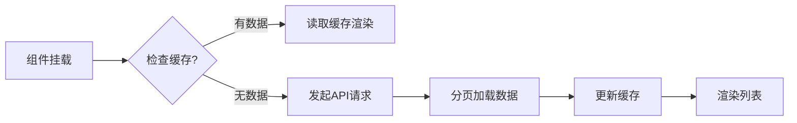
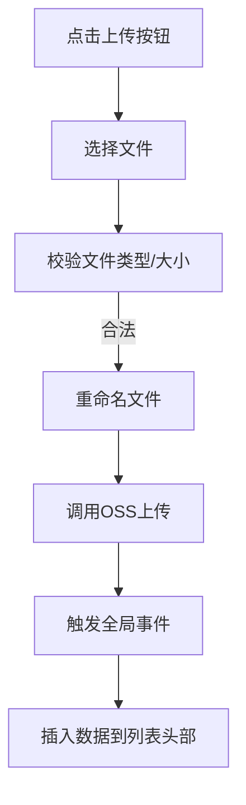
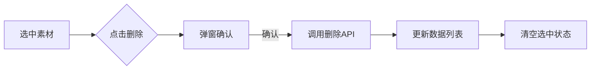
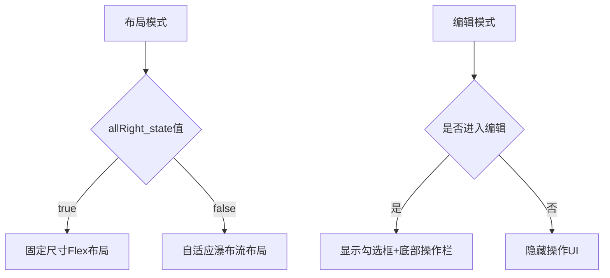
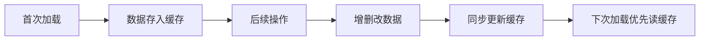

以下是 `MainUiLeftUpload` 组件的核心业务逻辑流程图，分为 **数据加载**、**用户操作**、**状态管理** 三个模块：

### 关键流程说明

---

#### **1. 数据加载流程**

---

#### **2. 文件上传流程**

---

#### **3. 删除操作流程**

---

#### **4. 状态切换逻辑**

---

#### **5. 数据缓存机制**

该流程图涵盖了组件的主要交互场景和状态变化逻辑，可结合代码中的以下核心函数理解：
- `getListData()`：数据加载
- `updateFile()`：文件上传
- `handleDeleteSelected()`：删除操作
- `handleSelectAll()`：全选逻辑
